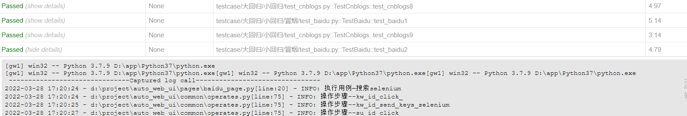

# 说明
- 结合docker-selenium和pytest进行分布式的测试
- 搭建过程可以参考[这里](http://www.shikun.work/aposts/d8b0934a/)

## 执行

- 直接输入命令 
```buildoutcfg
pytest -s testcase/大回归/小回归/冒烟 -n 3 --html=report.html --self-contained-html --capture=sys
```

- 运行runner.py中代码
```buildoutcfg
    pytest.main(['%s' %path,'-n 3', '--html=report.html','--self-contained-html', '--capture=sys'])

```

- 有执行的每个步骤
- 执行失败后截图
